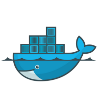

# 🐳 Installing Docker and Docker Compose

<p align="center">
  
  
</p>

## 🤖Automated Installation of Docker and Docker Compose

To install Docker and Docker Compose using Automated Installation, run the following command in your terminal:
     
```
bash <(curl -Ls https://raw.githubusercontent.com/your-username/your-repo/main/install-docker-and-compose.sh)
```

## 👩‍💻Manual Installation of Docker and Docker Compose

1️⃣ **Update package lists 🔄**
    
-   Run the following command to update the package lists:

    ```
    sudo apt update
    ```

2️⃣ **Install Docker 🐳**
    
-   Install Docker using the official Docker installation script:
        
     ```
    sudo curl -fsSL https://get.docker.com -o get-docker.sh && sudo sh get-docker.sh
    ```
        
3️⃣ **Add your user to the Docker group (optional) 🛠️**
    
-   Run the following command to add your user to the docker group.

    > **$USER**: This variable is automatically replaced with your actual username when you run the command. It represents the current logged-in user's username. Therefore, the command effectively adds your current user to the **`docker`** group, enabling you to run Docker commands without needing to prepend **`sudo`** each time.
        
    ```
    sudo usermod -aG docker $USER
    ```
        
4️⃣ **Log out and log back in 👣**
    
-   To apply the changes, log out of your SSH session and then log back in.

5️⃣ **Verify Docker installation ✅**
    
-   After logging back in, verify that Docker is installed correctly:

    ```
    docker --version
    ```
        
6️⃣ **Install Docker Compose 🐙**
    
-   Download and install **`Latest Version`** of Docker Compose using the following commands:
        
    ```
    sudo curl -L "https://github.com/docker/compose/releases/latest/download/docker-compose-$(uname -s)-$(uname -m)" -o /usr/local/bin/docker-compose && sudo chmod +x /usr/local/bin/docker-compose
     ```
        
7️⃣ **Verify Docker Compose installation ✅**
    
-   After installation, verify that Docker Compose is installed correctly:
        
    ```
    docker-compose --version
     ```

<br><br>

# 🎯 Introduction to Dockerfile

## What is a Dockerfile? 🐳
A Dockerfile is a text document that contains a set of instructions to build a Docker image. It automates the process of creating Docker images by specifying the environment, dependencies, and commands to be executed.

>**Note**: A Dockerfile is like a recipe for making a computer program. It tells the computer step-by-step how to build the program inside a special container.

## Key Instructions 📝
- **FROM**: Specifies the base image to use for the Docker image.
- **RUN**: Executes a command during the build process.
- **COPY**: Copies files from the host system to the Docker image.
- **ADD**: Similar to `COPY`, but can also handle remote URLs and unpack archives.
- **CMD**: Specifies the command to run when the container starts.
- **ENTRYPOINT**: Configures a container to run as an executable.
- **EXPOSE**: Informs Docker that the container listens on the specified network ports at runtime.
- **ENV**: Sets environment variables.
- **WORKDIR**: Sets the working directory for subsequent instructions.

## Creating a Dockerfile 🛠️

A Dockerfile is a script containing a series of instructions on how to build a Docker image.


#### Basic Structure
```Dockerfile
# Use an official base image
FROM <base_image>

# Set the working directory
WORKDIR /app

# Copy the current directory contents into the container at /app
COPY . /app

# Install any needed packages
RUN apt-get update && apt-get install -y <package_name>

# Make port 80 available to the world outside this container
EXPOSE 80

# Run <command> when the container launches
CMD ["<command>"]
```
## Important Dockerfile Keywords and Their Meanings 📚

1. **FROM**
   - **Description:** Specifies the base image to use for the Docker image. It defines the starting point for the Dockerfile and can be any publicly available image or a privately built one.
   - **Example:**

     ```Dockerfile
     FROM ubuntu:20.04
     ```

2. **WORKDIR**
   - **Description:** Sets the working directory inside the container where subsequent instructions will be executed. If the directory doesn't exist, it will be created.

   - **Example:**

     ```Dockerfile
     WORKDIR /app
     ```

3. **COPY**
   - **Description:** Copies files or directories from the local filesystem into the Docker image's filesystem at a specified path. The path is relative to the WORKDIR if specified.( `.` means everything).

   - **Example:**

     ```Dockerfile
     COPY . /app
     ```

4. **RUN**
   - **Description:** Executes a command within the Docker image's filesystem. It runs commands during the image build process, such as installing software packages.

   - **Example:**

     ```Dockerfile
     RUN apt-get update && apt-get install -y python3
     ```

5. **CMD**
   - **Description:** The `CMD` instruction sets the default command and/or parameters to execute when running a container. It can be overridden by specifying a command when starting the container with `docker run`.

     ```Dockerfile
     CMD ["python3", "app.py"]
     ```

6. **ENTRYPOINT**
   - **Description:** The `ENTRYPOINT` instruction allows you to configure a container to run as an executable. It specifies a command that will always be executed when the container starts, and it cannot be overridden at runtime. However, additional command-line arguments can be passed to the `ENTRYPOINT`.

   - **Example:**

     ```Dockerfile
     ENTRYPOINT ["python3", "app.py"]
     ```

7. **EXPOSE**
   - **Description:** Informs Docker that the container listens on specific network ports at runtime. It does not publish the port, but rather documents which ports the container uses.

   - **Example:**

     ```Dockerfile
     EXPOSE 80
     ```

8. **ENV**
   - **Description:** Sets environment variables within the Docker image. These variables can be used by scripts or applications running inside the container.

   - **Example:**

     ```Dockerfile
     ENV APP_ENV=production
     ```

9. **ADD**
   - **Description:** Copies files, directories, or remote URLs from the host into the Docker image. It can also extract compressed files like `.tar` archives into the image.extract tar files.

   - **Example:**
     ```Dockerfile
     ADD . /app
     ```

10. **VOLUME**
    - **Description:** Creates a mount point with the specified path and marks it as holding externally mounted volumes from native host or other containers.

    - **Example:**

      ```Dockerfile
      VOLUME /my_volume
      ```
<br>


## Dockerfile for a Simple Node.js Web Application 🚀

<br>

```dockerfile
# Use the official Node.js image as a base
FROM node:14

# Create and set the working directory
WORKDIR /usr/src/app

# Copy package.json and package-lock.json
COPY package*.json ./

# Install dependencies
RUN npm install

# Copy the rest of the application code
COPY . .

# Expose the application port
EXPOSE 8080

# Run the application
CMD ["node", "server.js"]
```

### Building and Running the Docker Image 🏗️

#### Build the Docker Image

```sh
docker build -t my-node-app .
```

#### Run the Docker Container

```sh
docker run -p 8080:8080 my-node-app
```

### Dockerfile Explanation and Usage 


- **FROM node:14**: This line specifies that we're starting with an official Node.js image from Docker Hub. Specifically, it uses Node.js version 14 as the base for our application.

- **WORKDIR /usr/src/app**: This command sets the working directory inside the Docker container to `/usr/src/app`. This is where our application code will reside within the container.

- **COPY package.json ./**: Here, we copy `package.json` and `package-lock.json` files from our local (your computer's) directory into the Docker container's working directory (`/usr/src/app`). These files typically contain information about our Node.js application's dependencies.

- **RUN npm install**: This command runs `npm install` inside the Docker container. It installs all the dependencies listed in `package.json` that we just copied. `npm` is the Node Package Manager used for managing Node.js packages and dependencies.

- **COPY . .**: Copies all files and directories from your local machine into the Docker container's working directory (`/usr/src/app`). This includes your Node.js application code.

- **EXPOSE 8080**: Informs Docker that the container will listen on port `8080`at runtime. This doesn't actually publish the port, but it serves as documentation and helps Docker understand which ports to map.

- **CMD ["node", "server.js"]**: the Node.js runtime and runs the `server.js` file, which is typically the entry point for a Node.js web application.

- **Build the Docker Image ["docker build -t my-node-app ."]**: This command builds a Docker image named `my-node-app` using the `Dockerfile` in the current directory (`.`).

- **Run the Docker Container ["docker run -p 8080:8080 my-node-app"]**: This command starts a new Docker container based on the `my-node-app` image. The `-p 8080:8080` option maps port 8080 on the host to port 8080 in the container, allowing access to the application running inside the container.


<br>

## Advanced Docker Topics 🌟

### 1. Multi-Stage Builds

### Description 🛠️
Multi-stage builds are a technique in Docker that helps in creating smaller and more efficient Docker images. It's particularly useful when you need to build an application but don't want to include unnecessary build tools or dependencies in the final image that will be deployed.

### Example 📦

```dockerfile
# First stage: build the application
FROM golang:1.16 AS builder
WORKDIR /app
COPY . .
RUN go build -o myapp

# Second stage: create the runtime image
FROM alpine:latest
WORKDIR /app
COPY --from=builder /app/myapp .
CMD ["./myapp"]
```

### Example Explanation

#### First Stage (`FROM golang:1.16 AS builder`):

- Uses a `golang` base image to build the application (`myapp`).
- Sets the working directory (`WORKDIR /app`) and copies the entire context (`.` which means all files from the current directory) into the Docker image.
- Runs `go build -o myapp` to compile the Go application into an executable named `myapp`.

#### Second Stage (`FROM alpine:latest`):

- Uses a minimal `alpine` Linux image as the base for the runtime image.
- Sets the working directory to `/app` and copies the compiled `myapp` executable from the previous stage (`--from=builder`) into this new image.
- Defines the default command to run when the container starts using `CMD ["./myapp"]`.

This two-stage approach allows you to keep only what's necessary for running the application in the final image (`alpine:latest`), while discarding all unnecessary build tools and intermediate files from the first stage (`golang:1.16`).

### 2. Best Practices 🚀

### Keep Images Small
- **Minimize the number of layers:** Each instruction in a Dockerfile creates a new layer in the image. To keep your images small, combine multiple instructions into a single `RUN` command where possible.
- **Reduce the size of the image:** Remove unnecessary files and dependencies to keep the image as small as possible. Use multi-stage builds to separate build dependencies from the final image.

### Use Official Images
- **Base your images on trusted, official images:** Start with official images from Docker Hub (e.g., `alpine`, `python`, `node`). Official images are regularly maintained and follow best practices, providing a secure and optimized base for your application.

### Leverage Caching
- **Order your instructions to maximize caching:** Docker caches the results of each layer. To take advantage of this, place the instructions that are less likely to change at the top of your Dockerfile. This way, when you make changes, Docker can reuse cached layers for the unchanged parts.
  - For example, place `RUN apt-get update && apt-get install -y ...` after copying only the necessary files needed for the installation.
  - Copy application code and other frequently changing files later in the Dockerfile to avoid invalidating the cache for previous layers.

By following these best practices, you can create efficient, secure, and maintainable Docker images.

## Why we use ❓
**Multi-stage builds ?**: It helps reduce the size of Docker images by separating the build environment from the runtime environment, making them faster to deploy and more secure.

**Best practices ?**: Focus on keeping Docker images small and secure by starting with trusted base images and optimizing the Dockerfile structure.

**Caching ?**: Understand how Docker caches layers to optimize build times, ensuring that only necessary parts of the image are rebuilt when changes are made.

<br><br>

# 💰 You can help me by Donating


<a href="https://buymeacoffee.com/pasinduljay" target="_blank"></a>
<a href="https://paypal.me/980822" target="_blank">
<br><br>